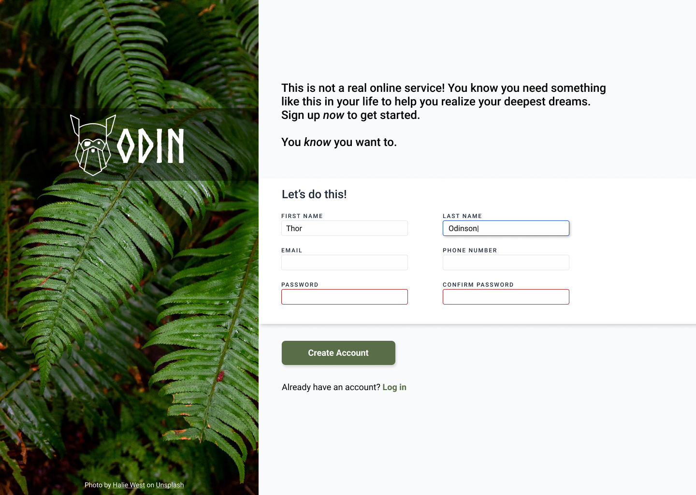
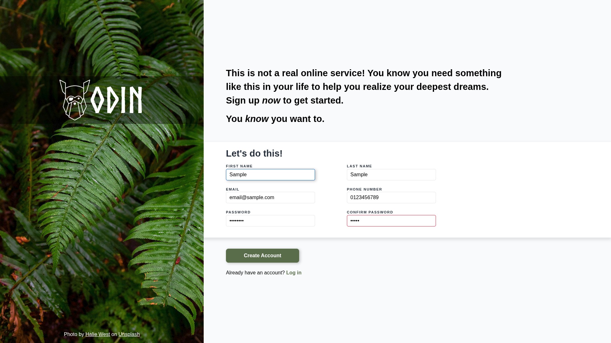

# Project: Sign-up Form | The Odin Project

## Description
This project is a sign-up web form for an imaginary service. The purpose of this project is to demonstrate the lessons I learned in Intermediate HTML and CSS Course in [Forms module](https://www.theodinproject.com/paths/full-stack-javascript/courses/intermediate-html-and-css), which includes form basics and validation.

<strong>Sample image of the project:</strong>

## My Final Output

## Demo

## GitHub Page
https://yehoshua-001.github.io/sign-up-form/

## Reference
Green leaf plant &mdash; [Halie West](https://unsplash.com/@haliewestphoto)  
Norse font &mdash; [Joel Carrouche](https://www.joelcarrouche.com/fonts/norse)  
CSS reset &mdash; [Josh W. Comeau](https://www.joshwcomeau.com/css/custom-css-reset/)  
